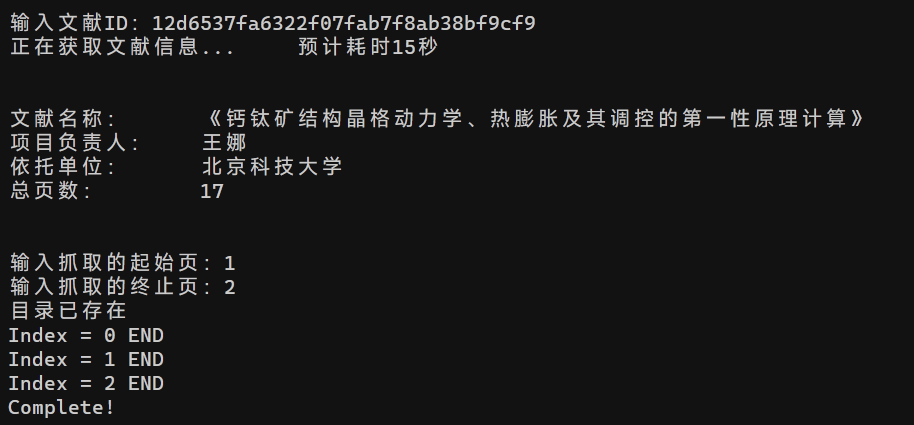

# Crawler

用于爬取用于爬取kd.nsfc.gov.cn资料的爬虫

# 食用方法

## 1. 打开Crawler.exe，输入文献ID

文献ID可以从网址中获取，例如：https://kd.nsfc.gov.cn/finalDetails?id=12d6537fa6322f07fab7f8ab38bf9cf9 ，“id=”后的16进制码即为文献id。

## 2. 文献信息核对

Crawler会自动查询文献ID，并向你展示查询的信息和总页数。

## 3. 输入需要下载的起始和终止页码

范围是 1 ~ [终止页] 的整数。如果起始页码为“1”，则会连带封面一起下载，封面页码为“0”。

## 4. 等待下载结束

当出现“Completed!”时，下载完成。

## 5. 继续抓取或退出

继续输入ID可以继续抓取内容，你也可以输入“0”来结束并退出程序。

# 文件保存路径

./Image/*文献名*

# WARNNING

程序目前没有输入内容合法性的检测，如果输入数值后闪退，请检查数数值是否正确。
